## Predictive Analysis of Housing Values - Identifying Influential Factors for Real Estate Industry by Chiamaka Aghaizu
 #### Overview
This project analyzes a housing dataset to predict home values using regression analysis. Key factors influencing home values include the number of floors, bathrooms, fireplaces, recent remodeling, while negative factors include the age of the house and excess kitchens. These findings provide valuable insights for real estate professionals in estimating and maximizing home values.

**Table of Contents**
1. Business Understanding

2. Data Understanding

3. Methodology - Data Preparation and Modeling
4. Model Specification
5. Deployment and Conclusion  
   1. Positive Influencers 
   2. Negative Influencers

### 1. <u>Business understanding</u>

The housing dataset we have at hand provides valuable insights into the
factors that impact the selling price of houses in the West Roxbury area
of Texas. By analyzing this data, we aim to answer key questions
regarding the influence of numerous variables on the selling price.

One of the primary motivations for real estate agents and companies is
to maximize their profits through higher selling prices, as their
commissions are typically based on these prices. Consequently,
determining the factors that drive the selling price is crucial. This
report focuses on predicting the selling price of houses and identifying
the variable that has the most significant positive impact on price.
Additionally, we will explore the variable that negatively affects the
selling price or has the least positive influence.

Identifying the variable with the least positive influence is especially
valuable for housing development companies. This knowledge helps them
make informed decisions about where not to invest their resources or
which aspects of a house require minimal investment. By understanding
these dynamics, companies can optimize their allocation of funds and
resources for new housing units.

### 2. <u>Data understanding </u>

The housing dataset consists of 5802 observations of houses located in
the West Roxbury area. It includes 14 attributes that provide valuable
information about each sample.

These attributes are as follows:

<u>Total value</u>: The estimated value of the house in thousands of
dollars.

<u>Tax:</u> The amount of tax to be paid for the house.

<u>Lot area:</u> The area of the lot in square feet.

<u>Year built:</u> The year in which the house was constructed.

<u>Gross area:</u> The total area of the house, including all floors, in
square feet.

<u>Living area:</u> The area of the house designated for living purposes
in square feet.

<u>Floors:</u> The number of floors in the house.

<u>Rooms:</u> The total number of rooms in the house.

<u>Bedrooms:</u> The number of bedrooms in the house.

<u>Full bathrooms:</u> The number of bathrooms with a shower, bathtub,
sink, and toilet.

<u>Half bathrooms:</u> The number of bathrooms with a sink and toilet,
but no shower or bathtub.

<u>Kitchens:</u> The number of kitchens in the house.

<u>Fireplaces:</u> The number of fireplaces in the house.

<u>Remodel:</u> Indicates whether the house has been remodeled or not,
with two possible values: recent or old.

During the data exploration process using Excel's Descriptive Statistics
tool, it was observed that none of the variables contained missing
values. The count for each attribute was consistently 5802, indicating
that all samples in the dataset have complete information. Consequently,
all available samples were utilized for the subsequent stages of
analysis and modeling. After running the descriptive statistics in
excel, the following results were the relevant values obtained:

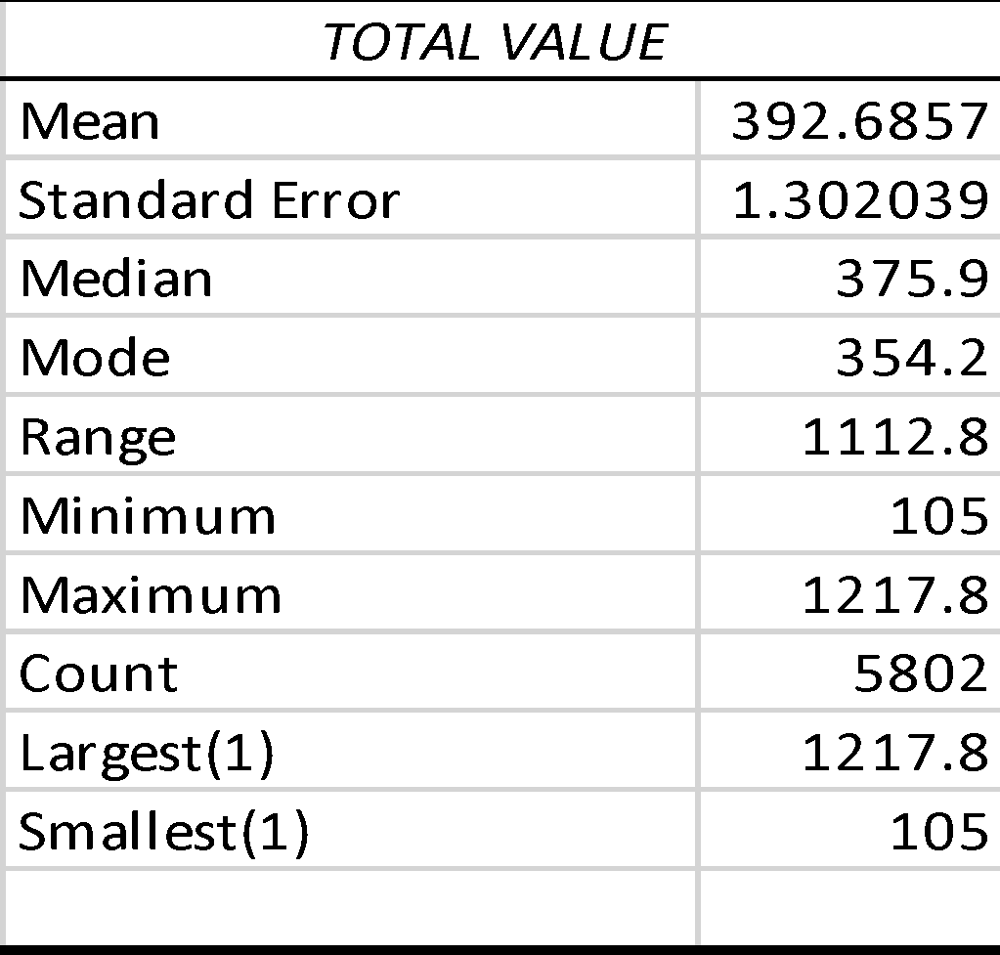
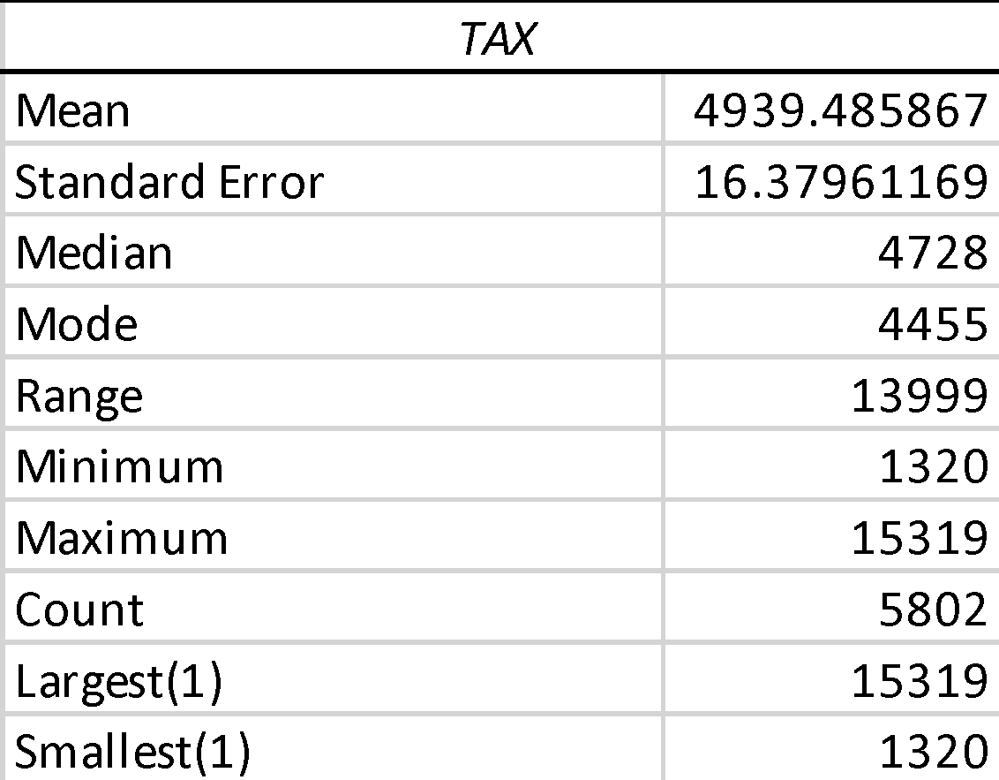
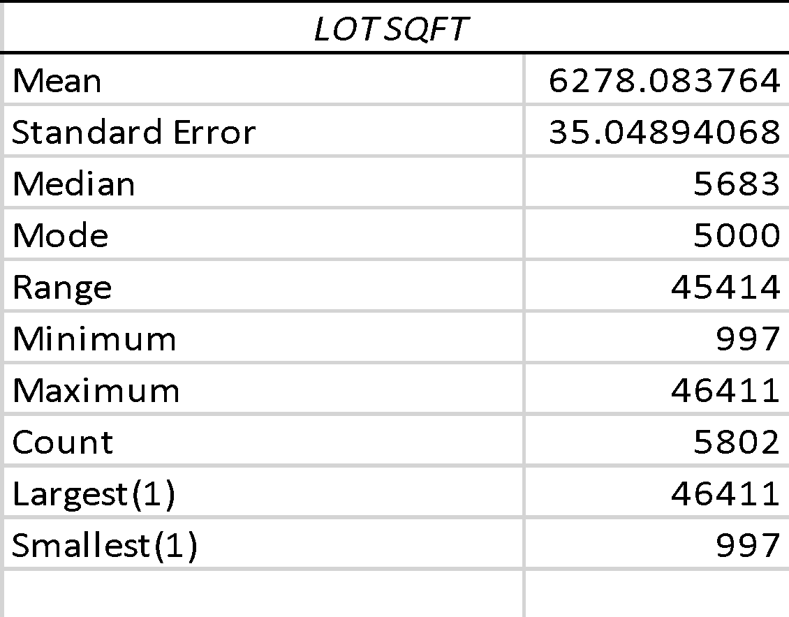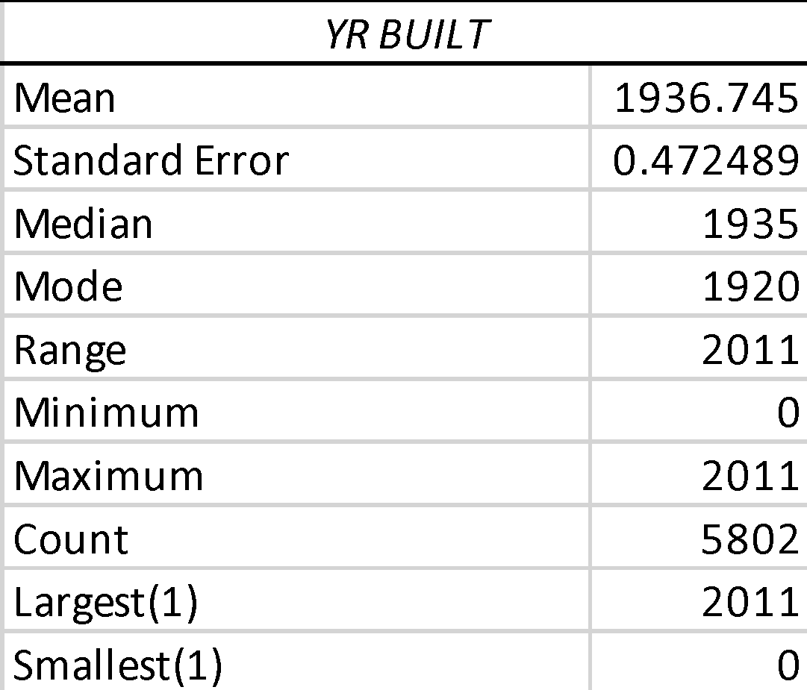
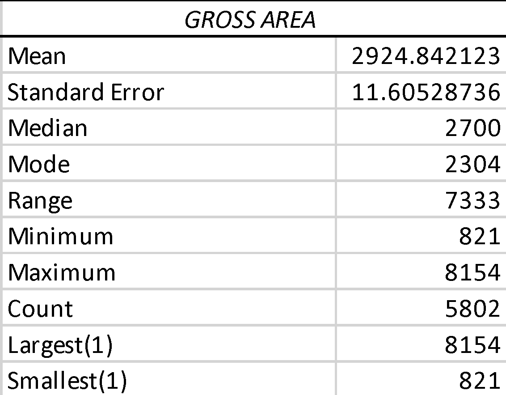
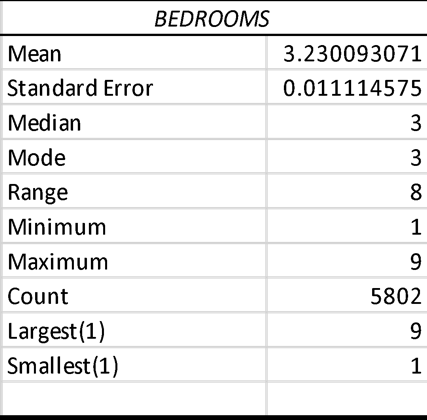
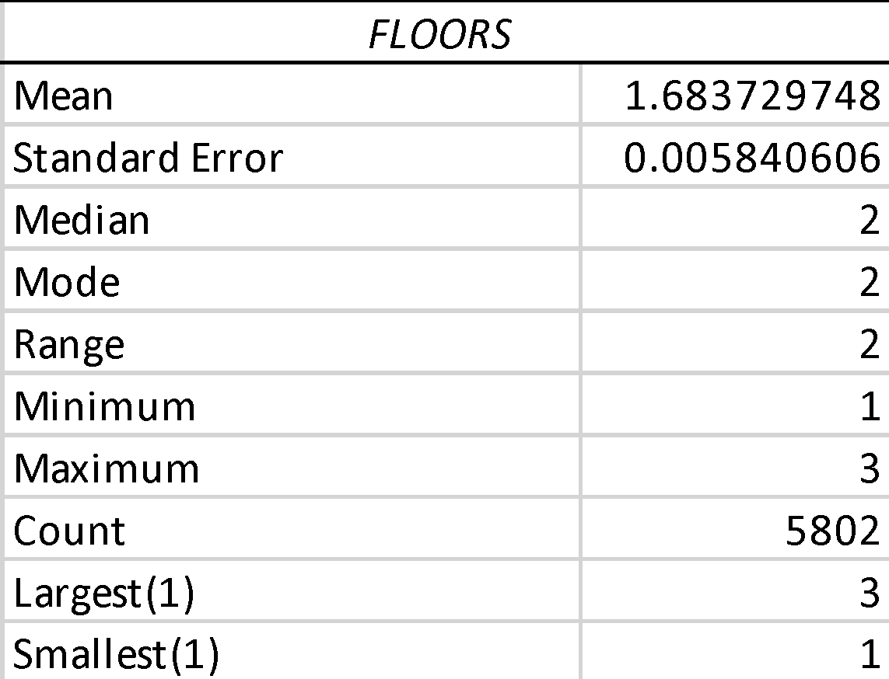
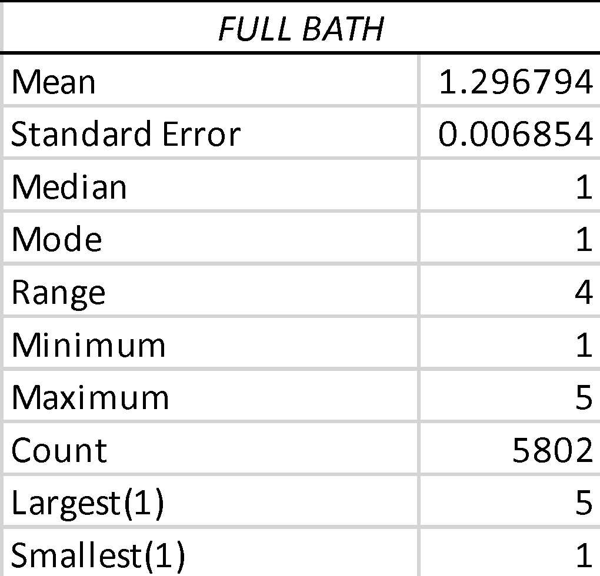
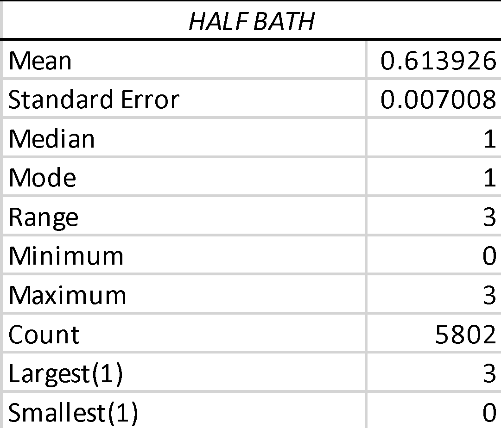
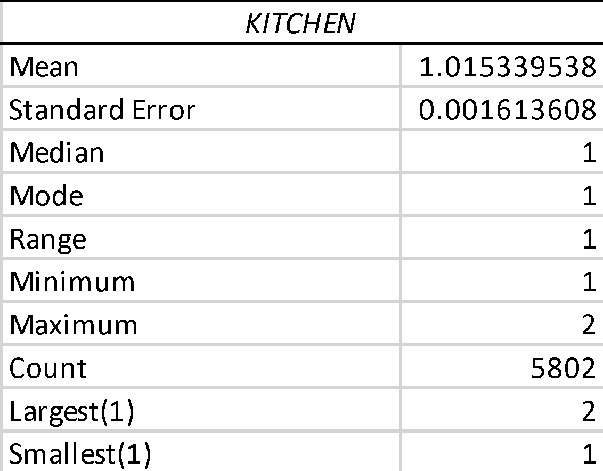

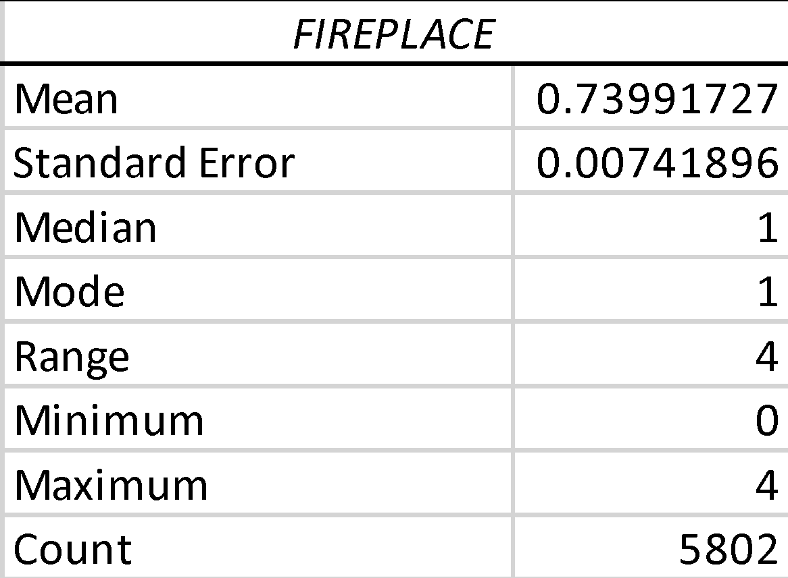

<u>Figure 1 : Relevant Descriptive Statistics of numerical variables in
West Roxbury Housing data</u>

Upon analyzing the provided values, two variables stand out: Year Built
and Kitchen. An anomaly is observed in the Year Built variable, where a
value of 0 suggests a potential entry error that needs to be addressed.
Additionally, the Kitchen variable indicates that houses in the dataset
are categorized into two options: 1 kitchen or 2 kitchens.

Although the dataset appears to have enough samples to support data
partitioning for analysis, the efficacy of the models will be evaluated
using p-values and adjusted R2 values. These statistical
measures will help assess the significance of the variables and
determine how well the models explain the variability in the selling
prices of houses.

**<u>  
</u>**

### 3. <u>Methodology - Data Preparation and Modeling</u>

To address the research question regarding the best predictors of
housing value, we conducted a regression analysis. In this analysis, we
considered the total value of the homes as the dependent variable. The
independent variables included tax, lot area in square feet, age of the
house, gross area, living area, number of floors, number of rooms,
number of bedrooms, number of full bathrooms, number of half bathrooms,
number of kitchens, number of fireplaces, and dummy variables indicating
recent remodeling or no remodeling.

The regression results, as shown in Figure 1, indicate a remarkably high
adjusted R-squared value of 99.999%. This suggests that the independent
variables effectively explain the dependent variable (total value).
However, it is important to note that this high adjusted R-squared value
is largely influenced by the inclusion of the tax variable. Since the
tax rate is typically based on the value of the home, it can be seen as
another determinant of housing value over time. As a result, the
adjusted R-squared value approaches 100%.

Figure 2, specifically the tax line fit plot, visually demonstrates this
relationship. With an R-squared value of 1, the inclusion of the tax
variable dominates the other independent variables, making it
challenging to discern their individual contributions to explaining the
total value of the homes.

<u>Figure 2</u> – Line Plot Showing Relationship between Tax and Total
Value

A closer examination of the data reveals that when conducting the F
test, the p-value (Significance F) is less than 0.05. This result
suggests that the coefficients of the independent variables, when
considered together, are statistically significant in explaining the
dependent variable.

However, when we examine the p-values of each individual coefficient for
the independent variables, we find that, except for tax (which has a
p-value of zero), all other variables have p-values greater than 0.05.
This indicates that these variables are not statistically significant on
their own, except for tax.

Considering these findings, it is decided to rerun the regression
analysis while excluding taxes as one of the independent
variables.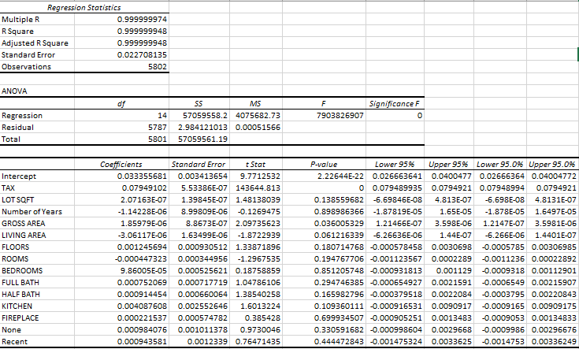<u>Figure 3 – Multiple
Regression output 1.</u>

Furthermore, by rerunning the regression analysis while excluding the
tax variable, we obtained new regression results, as shown in Figure 2.
With the exclusion of tax, the adjusted R-squared value decreased to
81.35%. This suggests that approximately 81.35% of the total variation
in the dependent variable (total value of homes) can be explained by the
remaining independent variables.

The F-test in this regression indicates that the independent variables,
when considered together, are statistically significant. This is evident
from the p-value (Significance F) being less than 0.05, suggesting that
the overall model is significant.

On further examination of the individual p-values for the independent
variables, all variables except for the number of rooms and bedrooms are
statistically significant at the 0.05 significance level. Therefore, it
is decided to exclude the number of rooms and bedrooms from the
regression model and rerun the analysis with the remaining
variables.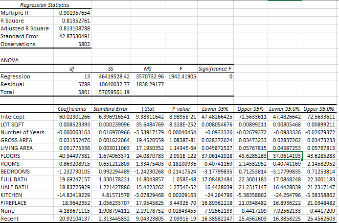

<u>Figure 4- Multiple Regression output 2</u>

Our final regression results, as depicted in Figure 3, exhibit a similar
adjusted R-squared value of 81.3% compared to the previous model. This
suggests that the independent variables still effectively explain
approximately 81.3% of the total value of the houses.

The F-test result indicates that, once again, the independent variables,
when considered together, are statistically significant. The p-value
(Significance F) being less than 0.05 confirms that the overall model is
statistically significant.

Furthermore, when examining the individual p-values of the independent
variables, we find that all variables have p-values less than 0.05. This
signifies that each independent variable is statistically significant in
predicting the total value of a house.

Overall, these findings highlight that the independent variables in the
final regression model significantly contribute to explaining the
variation in the total value of a
house.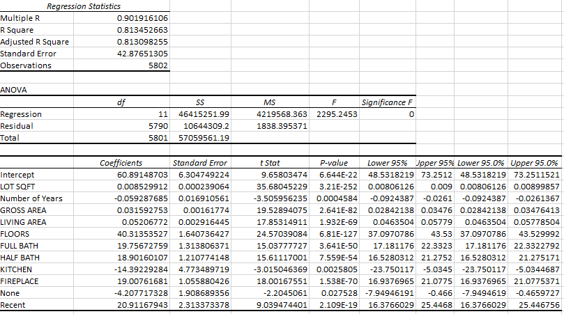

<u>Figure 5- Multiple Regression output 3</u>

### 4. <u>Model Specification </u>

Based on the analysis conducted in Figure 3, a regression model that can
effectively predict home values has been developed. The model includes
the following independent variables:

**Total Value *i* =β0+ β1 (Lot SQFT)
*i* + β2 (Number of Years) *i* + β3
(Gross Area) *i* + β4 (Living Area)
*i* + β5 (Floors)*i* + β6
(Full Bath) *i* + β7 (Half Bath) *i* +
β8 (Kitchen) *i* + β9
(Fireplace)*i* + β10 (None) *i* +
β11 (Recent) *i* + 𝝴*i***

Where;

*Βi= Corresponds to the coefficient of the variable in
question.*

*Total Value i = measures the total value of home i.*

*Lot SQFT i = measures the lot per square feet of home i.*

*Number of Years i = measures the number of years since home
i was built. For example, a home built in 2000 is 2021- 2000 =21years
old.*

*Gross Area i = measures the gross area of home i, that is,
areas that are not heated or cooled example garage etc.*

*Living Area i = measures the living area for home i, that is
areas in the home that are livable (heated and cooled).*

*Floors i = measures the number of floors of home i. From
1,2,3…. n, with 1 being a home with one, 2 being a home with two floor
and “n” being a home with “n” number of floors.*

*Full Bath i = measures the number of full baths in home i.
From 0,1,2,3…. n, with 1 being a home with one full bath, 2 being a home
with two full baths and “n” being a home with “n” number of full baths.*

*Half Bath i = measures the number of half baths in home i.
From 0,1,2,3…. n, with 1 being a home with one half bath, 2 being a home
with two half baths and “n” being a home with “n” number of half baths.*

*Kitchen i = measures the number of kitchens in home i. From
0,1,2,3…. n, with 0 being a home with no kitchen, 1 being a home with
one kitchen and “n” being a home with “n” number of kitchens.*

*Fireplace i = measures the number of fireplaces in home i.
From 0,1,2,3…. n, with 0 being a home with no fireplace, 1 being a home
with one fireplace and “n” being a home with “n” number of fireplaces.*

*<u>Dummy Variables</u>*

*Recent i = 1, if home i has recently been remodeled and 0,
if otherwise*

*None i = 1, if home i has no remodeling and 0, if
otherwise.*

*𝝴 i = This is denoted as the error term; it signifies the
variation in the dependent variable that is not explained by the
independent variables of this research. Some of these include the
location of the home, economic indicators such as interests etc.*

**<u>  
</u>**

### 5. <u>Deployment and Conclusion </u>

Based on the regression model and findings presented above, we have
derived several key insights that are relevant to the home valuation
industry. These findings can assist real estate agents, developers, and
contractors in estimating and maximizing the value of homes.

- 5.1  **Positive Influencers:**

<u>Number of Floors:</u> Homes with multiple floors have a significant
positive impact on the total value.

<u>Full and Half Baths:</u> Houses with a higher number of full or half
baths tend to have higher total values.

<u>Number of Fireplaces:</u> Homes with more fireplaces are associated
with increased total values.

<u>Recent Remodeling:</u> Houses that have undergone recent remodeling
experience a positive influence on their total value.

- 5.2 **Negative Influencers:**

<u>Age of the House:</u> The number of years since a house was built
negatively affects its total value.

<u>Kitchen:</u> Surprisingly, the number of kitchens in a home has a
negative impact on the total value.

<u>No Remodeling:</u> Houses that have not been remodeled also exhibit a
negative influence on their total value.

These findings allow real estate agents and developers to make informed
decisions. They can focus on aspects that positively affect home values,
such as increasing the number of floors, baths, and fireplaces, as well
as emphasizing recent remodeling. Conversely, they can avoid unnecessary
expenses on additional kitchens, as it does not significantly contribute
to the total value, according to our regression model.

It is worth noting that the negative coefficient of the kitchen variable
might seem counterintuitive given its positive correlation with the
total value. However, this disparity can be attributed to the fact that
correlation only considers linear dependence, while regression considers
the influence of other independent variables. Thus, in the context of
the other predictors, having more kitchens has a diminishing effect on
the total value compared to factors like living area or gross area.

In conclusion, this project successfully achieved the business objective
of predicting the value/selling price of a house and identifying the
variables that have the greatest positive and negative influence on the
total value. The regression model provides valuable insights for real
estate agents, developers, and contractors, enabling them to make
informed decisions when it comes to pricing, construction, and
remodeling strategies.

